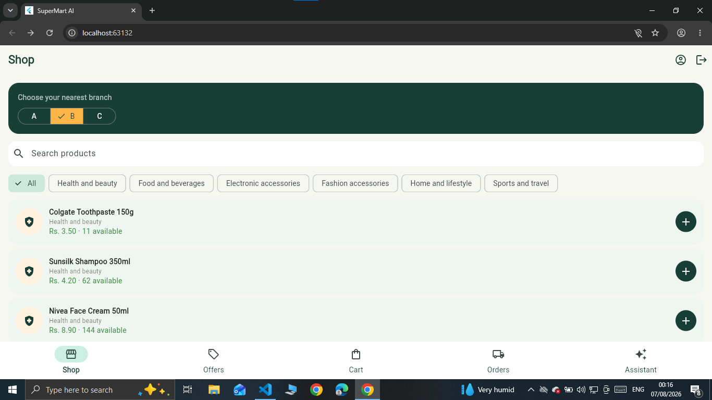
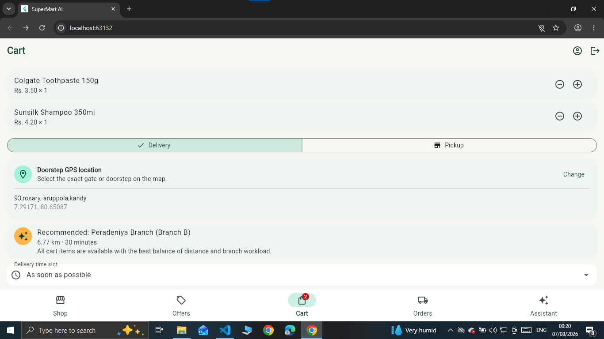
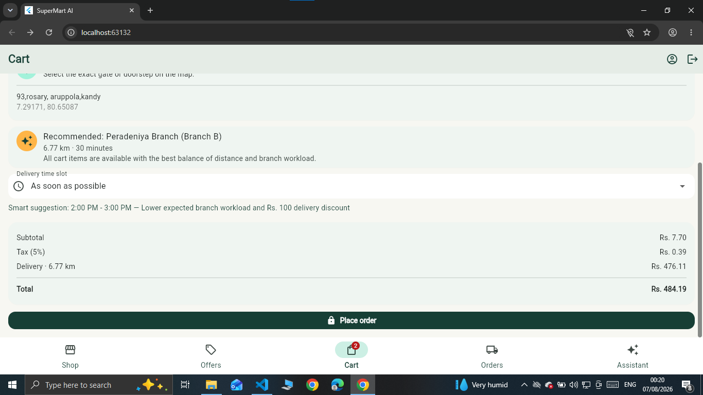

🛒 SuperMart AI – Smart Supermarket & SmartRoute Delivery System

SuperMart AI is a full stack smart supermarket application developed using Flutter, Flask, SQLite, OpenStreetMap and Machine Learning.

The system provides separate features for customers and supermarket managers. Customers can browse products, manage their shopping cart, place orders, select delivery locations and use SmartRoute delivery features. Managers can monitor products, inventory, orders and AI based business information.

---

🚀 Main Features

👤 Customer Features

- User registration and login
- Browse supermarket products
- View product information
- Add products to shopping cart
- Checkout and place orders
- Delivery and pickup options
- Smart branch recommendation
- GPS delivery location selection
- OpenStreetMap integration
- SmartRoute delivery
- Order tracking
- Secure delivery verification

📊 Manager Features

- Manager dashboard
- Product management
- Inventory monitoring
- Order management
- Staff information
- Branch information
- Business performance information
- AI-supported insights

🤖 Artificial Intelligence Features

The system also includes Machine Learning functionality for supermarket business analysis.

Machine Learning is used to support areas such as:

- Income prediction
- Business performance analysis
- Category-based analysis
- Smart decision support
- Rush-hour and staffing insights

---

📱 Application Screenshots

🛍️ Products

  

Customers can browse available supermarket products and view product information.

---

🛒 Shopping Cart

  

Customers can add products to their cart and manage items before placing an order.

---

 💳 Checkout

  

The checkout section allows customers to review their order and continue with delivery or pickup.

---

📍 SmartRoute Location Selection

  

OpenStreetMap is integrated into the application to allow customers to select their delivery location.

---

🧠 Smart Branch Selection

  

The Smart Branch feature helps select a suitable supermarket branch using information such as location, availability and delivery conditions.

---

🛠️ Technologies Used

| Area | Technology |

| Mobile Application | Flutter |
| Programming Language | Dart |
| Backend API | Flask |
| Backend Language | Python |
| Database | SQLite |
| Maps | OpenStreetMap |
| Flutter Maps | flutter_map |
| Location | Geolocation / GPS |
| Machine Learning | XGBoost |
| Data Processing | Python |
| API Communication | REST API |
| Version Control | Git & GitHub |

---

🏗️ System Architecture

The SuperMart system follows a client-server architecture.

Flutter Mobile Application
          |
          |
       REST API
          |
          v
      Flask Backend
          |
   -------------------
   |        |        |
SQLite     ML      Business
Database  Models     Logic
