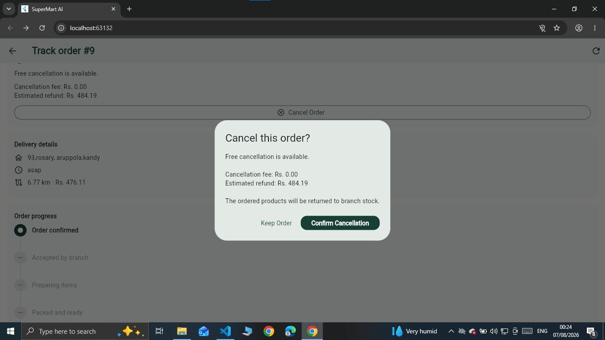

# 🛒 SuperMart AI
### Smart Supermarket & Doorstep Delivery System

SuperMart AI is a full-stack supermarket application developed using **Flutter, Flask, SQLite, OpenStreetMap and Machine Learning**.

The main highlight is the **SmartRoute Doorstep Delivery System**, which allows customers to select their exact doorstep, receive a smart branch recommendation, track delivery progress, use secure PIN handover and access a controlled cancellation system.

---

## 🌟 Key Features

### Customer
- Product browsing
- Shopping cart and checkout
- Delivery and pickup
- Exact doorstep selection using OpenStreetMap
- Smart branch recommendation
- Delivery tracking
- Delivery PIN verification
- Smart cancellation system

### Manager
- Manager dashboard
- Product and inventory management
- Order monitoring
- Staff and branch information
- AI-based business insights

---

## 🚚 SmartRoute Doorstep Delivery

Customers can select their exact **gate or doorstep** directly on the map instead of depending only on a written address.

<p align="center">
  
</p>

The system can consider:

**Distance + Stock + Pending Orders + Preparation Time + Delivery Conditions**

to recommend a suitable branch.

<p align="center">
  
</p>

---

## 🚫 Smart Cancellation

Cancellation depends on the current order and delivery stage.

| Stage | Rule |
|---|---|
| Pending / Confirmed | Free cancellation |
| Preparing / Packed | Charges may apply |
| Rider Assigned | Delivery charges may apply |
| Rider more than 300m away | Cancellation may still be requested |
| Rider within 300m | Cancellation locked |
| Delivered | Cancellation unavailable |

Customers must provide a valid cancellation reason before the request is processed.

<p align="center">
  
</p>

---

## 🔐 Secure Delivery

A **4-digit delivery PIN** can be used during final handover to confirm that the order has reached the correct customer.

```text
Order → Rider Assigned → Delivery Tracking
          ↓
     Rider Approaches
          ↓
     PIN Verification
          ↓
       Delivered
```

---

## 📱 Screenshots

### Products
<p align="center">
  
</p>

### Cart
<p align="center">
  
</p>

### Checkout
<p align="center">
  
</p>

---

## 🤖 Machine Learning

The project also includes Machine Learning features for:

- Income prediction
- Category analysis
- Business insights
- Staffing support
- Inventory decision support

Resources are available inside:

```text
model/
data/
notebooks/
```

---

## 🛠️ Technologies

| Area | Technology |
|---|---|
| Frontend | Flutter / Dart |
| Backend | Flask / Python |
| Database | SQLite |
| Maps | OpenStreetMap |
| Machine Learning | XGBoost |
| API | REST API |

---

## 📂 Project Structure

```text
SuperMart-AI-SmartRoute/
│
├── api/
├── data/
├── lib/
├── model/
├── notebooks/
├── screenshots/
├── test/
├── web/
├── pubspec.yaml
└── README.md
```

---

## ▶️ Running the Project

Flutter:

```bash
flutter pub get
flutter run
```

Backend:

```bash
cd api
python app.py
```

---

## 💡 Main Idea

SuperMart AI connects the complete supermarket delivery journey:

**Product Selection → Smart Branch → Exact Doorstep → Delivery Tracking → Controlled Cancellation → Secure PIN Handover**

---

### Smart Shopping. Smarter Delivery.
