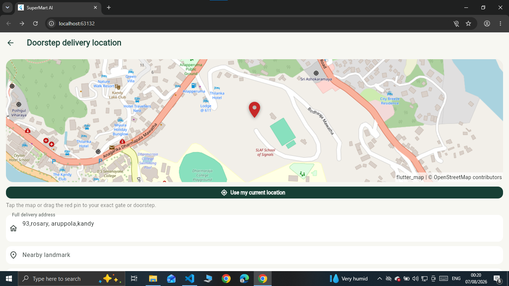
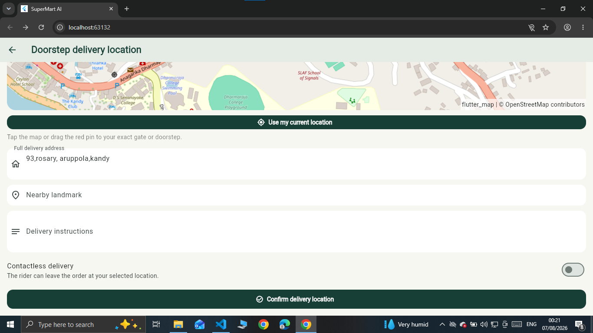

🛒 SuperMart AI – Smart Supermarket & Intelligent Doorstep Delivery System

SuperMart AI is a full-stack supermarket shopping and management application developed using Flutter, Flask, SQLite, OpenStreetMap and Machine Learning.

The project is designed not only as an online supermarket application, but also as a smarter approach to doorstep delivery.

One of the main highlights of SuperMart AI is the **SmartRoute Doorstep Delivery System**, where customers can select their exact gate or doorstep using an interactive map, receive an intelligent branch recommendation, track the delivery journey and securely confirm the final handover.

The system also introduces a **Smart Cancellation Policy** that considers the current order stage and the rider's distance from the customer's doorstep before allowing a cancellation.

---

# 🌟 Main Project Highlight

## 🚚 SmartRoute Doorstep Delivery

Instead of asking the customer to enter only a normal text address, SuperMart allows the customer to select the **exact delivery point, gate or doorstep** directly on an OpenStreetMap.

The selected GPS location is then used by the system for delivery planning and tracking.

  

The SmartRoute delivery process includes:

1. Exact GPS doorstep selection using OpenStreetMap.
2. Draggable map marker for selecting the customer's exact gate or entrance.
3. Customer current-location support.
4. Delivery address and landmark information.
5. Smart branch recommendation.
6. Branch selection based on distance, stock availability, pending orders, preparation time and estimated delivery conditions.
7. Delivery fee calculation.
8. Delivery route visualization.
9. Live rider location during delivery.
10. Completed and remaining route information.
11. Order delivery status tracking.
12. Secure 4-digit delivery PIN for final handover.
13. Delivery confirmation after the customer receives the order.

---

# 🧠 Smart Branch Recommendation

SuperMart does not simply select the geographically closest supermarket branch.

The system considers several operational factors before recommending a suitable branch for the customer's order.

  

The recommendation can consider:

Customer distance + Product stock + Pending orders + Preparation time + Estimated delivery time.

This allows SuperMart to select a branch that may provide a better delivery experience instead of relying only on distance.

---

🚫 Intelligent Delivery Cancellation Policy

Another special feature of SuperMart is its **stage-aware delivery cancellation system.

Many delivery applications use a simple cancellation button. SuperMart makes the decision based on how far the order has already progressed.

Before confirming a cancellation, the customer is required to provide a valid cancellation reason. The system then checks the current order status and applies the appropriate cancellation rule.

| Order Stage | Cancellation Rule |
| Pending | Free cancellation |
| Confirmed | Free cancellation |
| Preparing | Cancellation allowed with Rs. 100 preparation fee |
| Ready | Cancellation allowed with Rs. 150 packing fee |
| Rider Assigned | Cancellation allowed, but delivery-related charges may apply |
| Out for Delivery – Rider more than 300m away | Cancellation can still be requested; delivery fee + Rs. 100 travelling fee applies |
| Rider within 300m of doorstep | Cancellation is locked |
| Delivered | Cancellation is not available |
| Already Cancelled | No further cancellation request is allowed |

When the rider reaches the final **300-metre doorstep zone**, the system protects the delivery from unnecessary last-minute cancellation.

The customer will receive a message such as:

Cancellation is unavailable because the rider is within 300 metres of your doorstep.

This approach helps protect both the customer and supermarket operations by considering food/product preparation, packing, delivery effort and the rider's travelling distance.

If a valid cancellation is completed, the system can restore the cancelled order stock, release the assigned rider for another delivery and invalidate the delivery PIN.

---

🔐 Secure Doorstep Handover

SuperMart also provides additional protection for the final delivery stage.

When a doorstep delivery is dispatched, a **4-digit delivery PIN** is generated for the order.

The PIN is used to verify that the order has reached the correct customer before marking the delivery as completed.

This creates a more controlled handover process than simply allowing a rider to mark an order as delivered.

---

📍 Smart Delivery Flow

Customer selects products
          ↓
      Shopping Cart
          ↓
        Checkout
          ↓
 Select Doorstep Delivery
          ↓
Select exact gate/doorstep
   using OpenStreetMap
          ↓
Smart Branch Recommendation
          ↓
     Order Confirmed
          ↓
Preparation & Packing
          ↓
      Rider Assigned
          ↓
   Out for Delivery
          ↓
Live Route / Rider Tracking
          ↓
  Rider approaches doorstep
          ↓
Cancellation locked within 300m
          ↓
4-digit Delivery PIN Verification
          ↓
      Order Delivered
